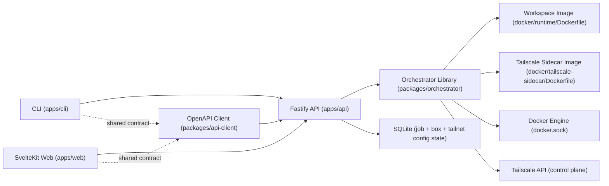

# Architecture

This repo is an npm-workspaces monorepo with strict privilege boundaries between API, web, and CLI.

## Components
- Orchestrator library: [`packages/orchestrator/src`] owns box lifecycle (`create/start/stop/remove`), grouped resource cleanup, job orchestration, and Docker allowlisted operations.
- API service: [`apps/api/src/app.ts`] is a thin Fastify wrapper around orchestrator calls and SSE endpoints; OpenAPI is exposed at `/openapi.json`.
- Runtime status monitor: orchestrator subscribes to Docker container events via [`packages/orchestrator/src/dockerode-runtime.ts`] and reconciles box state from both grouped containers.
- Box log streaming: API exposes box-scoped SSE logs (`/v1/boxes/:boxId/logs`) and forwards workspace-container logs only.
- Shared API client: [`packages/api-client/src`] is generated from OpenAPI and used by both web and CLI.
- Web app: [`apps/web/src/routes/+page.server.ts`] handles initial SSR fetch/gating, and [`apps/web/src/lib/devbox-store.ts`] applies SSE updates after hydration.
- CLI app: [`apps/cli/src/index.ts`] is an API client only and does not access Docker or DB directly.

## Trust boundaries
- API is the only privileged service and is the only service that can mount `docker.sock`.
- Orchestrator operations are constrained to managed resources via allowlisted calls and labels.
- Each box is a grouped runtime with two containers:
  - workspace container: unprivileged SSH workspace process, no `NET_ADMIN`, no `/dev/net/tun`, no Tailscale bootstrap.
  - Tailscale sidecar: privileged network owner for the shared namespace, with `/dev/net/tun`, `NET_ADMIN`, `NET_RAW`, Tailscale bootstrap, and inbound firewall rules.
- Web and CLI are unprivileged API consumers and never access Docker or DB directly.
- API and web are deployed as separate containers/services.

## Tailscale integration
- Tailnet config (OAuth credentials, tags, hostname prefix) is stored in single-row `tailnet_config` SQLite state.
- Config is locked (409) while boxes exist to prevent credential drift.
- Box creation mints a per-box Tailscale auth key and creates a grouped runtime:
  - one sidecar container on the per-box Docker network
  - one workspace container with `NetworkMode=container:<tailscale-sidecar>`
- Device capture happens from the control plane by deterministic hostname and persists `tailnetDeviceId` for cleanup.
- Cleanup is one shared idempotent path for create-failure compensation, remove flows, and external container deletion cleanup jobs.
- External deletion of either grouped container triggers cleanup rather than leaving partial state behind.

## Runtime network model
- Each box gets a dedicated Docker network (`devbox-net-<boxId>`) to keep boxes isolated from each other at the Docker layer.
- Only the Tailscale sidecar attaches directly to that network.
- The workspace container joins the sidecar network namespace with Docker container-network-mode sharing.
- Inbound traffic is restricted to Tailnet traffic by firewall rules applied inside the sidecar-owned namespace.
- Outbound connectivity still follows normal Docker bridge behavior unless the host or Docker daemon adds additional policy.

## Key references
- Compose deployment wiring: [`docker-compose.yml`]
- Environment contract: [`ENV.md`]
- Setup and user workflows: [`USAGE.md`]
