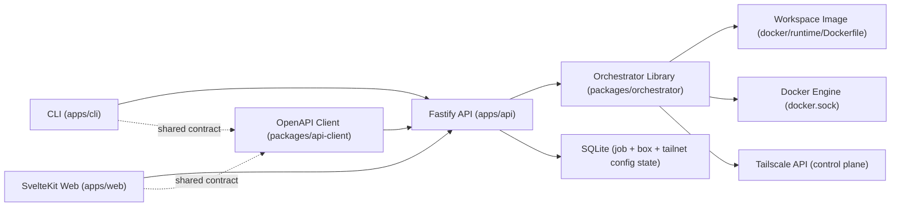

# Architecture

This repo is an npm-workspaces monorepo with strict privilege boundaries between API, web, and CLI.

## Components
- Orchestrator library: [`packages/orchestrator/src`] owns box lifecycle (`create/start/stop/remove`), cleanup, job orchestration, and Docker allowlisted operations.
- API service: [`apps/api/src/app.ts`] is a thin Fastify wrapper around orchestrator calls and SSE endpoints; OpenAPI is exposed at `/openapi.json`.
- Runtime status monitor: orchestrator subscribes to Docker container events via [`packages/orchestrator/src/dockerode-runtime.ts`] and reconciles box state from the managed workspace container.
- Box log streaming: API exposes box-scoped SSE logs (`/v1/boxes/:boxId/logs`) and forwards the managed workspace container logs.
- Shared API client: [`packages/api-client/src`] is generated from OpenAPI and used by both web and CLI.
- Web app: [`apps/web/src/routes/+page.server.ts`] handles initial SSR fetch/gating, and [`apps/web/src/lib/devbox-store.ts`] applies SSE updates after hydration.
- CLI app: [`apps/cli/src/index.ts`] is an API client only and does not access Docker or DB directly.

## Trust boundaries
- API is the only privileged service and is the only service that can mount `docker.sock`.
- Orchestrator operations are constrained to managed resources via allowlisted calls and labels.
- Each box is one workspace container that runs `tailscaled`, enables Tailscale SSH, and hosts the developer shell and workloads.
- Because the workspace keeps full `sudo` and runs `tailscaled`, the workspace container is part of the trusted boundary for box-local networking state.
- Web and CLI are unprivileged API consumers and never access Docker or DB directly.
- API and web are deployed as separate containers or services.

## Tailscale integration
- Tailnet config (OAuth credentials, tags, hostname prefix) is stored in single-row `tailnet_config` SQLite state.
- Config is locked (409) while boxes exist to prevent credential drift.
- Box creation mints a per-box Tailscale auth key, starts one workspace container on its dedicated Docker network, and persists `tailnetDeviceId` for cleanup.
- Tailscale SSH terminates directly in the workspace container.
- Cleanup is one shared idempotent path for create-failure compensation, remove flows, and external container deletion cleanup jobs.

## Runtime network model
- Each box gets a dedicated Docker network (`devbox-net-<boxId>`) to keep boxes isolated from each other at the Docker layer.
- A box container only joins its own Docker network, so boxes cannot directly reach each other over Docker bridge networking.
- Each box is also a real Tailscale node, so boxes can reach each other over Tailscale if ACL and tag policy allow it.
- Running `tailscaled` in the workspace keeps Tailnet SSH simple for developers and makes it easy to expose box-local services such as development web apps on the box's Tailnet address.
- Orchestrator does not publish Docker host ports for boxes and does not use host networking.
- The Docker host may still be able to reach container IPs on per-box bridge networks; preventing host-local reachability is out of scope for this implementation.
- Services started inside a box may be reachable over that box’s Tailnet address if Tailscale ACLs permit it.
- This implementation does not guarantee protection against a full-sudo workspace user changing box-local networking state.
- Examples of box-local boundaries a full-sudo user can still break:
  - start extra listeners that become reachable on the box's Tailnet IP or hostname
  - add ad hoc port forwards or reverse proxies inside the box
  - change routes, iptables rules, or other box-local network configuration
  - reconfigure or interfere with the box's own Tailscale connectivity from inside that workspace

## Key references
- Compose deployment wiring: [`docker-compose.yml`]
- Environment contract: [`ENV.md`]
- Setup and user workflows: [`USAGE.md`]
