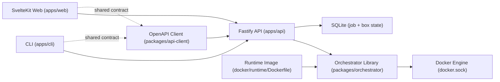

# Architecture

This repo is an npm-workspaces monorepo with strict privilege boundaries between API, web, and CLI.

## Components
- Orchestrator library: [`packages/orchestrator/src`] owns box lifecycle, job orchestration, and Docker allowlisted operations.
- API service: [`apps/api/src/app.ts`] is a thin Fastify wrapper around orchestrator calls and SSE endpoints; OpenAPI is exposed at `/openapi.json`.
- Runtime status monitor: orchestrator subscribes to Docker container events via [`packages/orchestrator/src/dockerode-runtime.ts`] and publishes reconciled `box.updated` events for live UI state.
- Shared API client: [`packages/api-client/src`] is generated from OpenAPI and used by both web and CLI.
- Web app: [`apps/web/src/routes/+page.server.ts`] handles initial SSR fetch/gating, and [`apps/web/src/lib/devbox-store.ts`] applies SSE updates directly after hydration with reconnect + single resync behavior.
- CLI app: [`apps/cli/src/index.ts`] is an API client only and does not access Docker or DB directly.
- Runtime image: [`docker/runtime/Dockerfile`] defines the image used for created dev boxes.

## Trust boundaries
- API is the only privileged component and is the only service that can mount `docker.sock`.
- Orchestrator operations must be allowlisted and constrained to managed resources.
- Web and CLI are unprivileged API consumers and never access Docker or DB directly.
- API and web are deployed as separate containers/services.

## Key references
- Compose deployment wiring: [`docker-compose.yml`]
- Environment contract: [`ENV.md`]
- Setup and user workflows: [`USAGE.md`]
