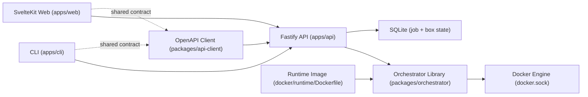

# Architecture

This repo is a small npm-workspaces monorepo with strict privilege boundaries.

## Components
- Orchestrator library: [`packages/orchestrator/src`] encapsulates box/job logic, allowlisted Docker operations, label ownership checks, and in-process job execution.
- Runtime image policy: box creation image is fixed by orchestrator config (`DEVBOX_RUNTIME_IMAGE`, default `devbox-runtime:local`) and not user-selectable from API/web/CLI.
- Runtime env policy: create flow injects server-configured runtime env values into every created container (config overrides request env for matching keys); Compose mounts `docker/runtime/runtime.env` and API reads all entries from that file.
- Orchestrator read-path reconciliation: [`packages/orchestrator/src/orchestrator.ts`] reconciles stable box statuses on `listBoxes`/`getBox` against Docker inspect state before API responses, persisting drift corrections without emitting read-triggered `box.updated`.
- Orchestrator failure semantics: lifecycle job failures mark affected boxes as `error` so boxes are not stranded in transitional states.
- Docker runtime adapter: [`packages/orchestrator/src/dockerode-runtime.ts`] talks to Docker Engine API using `dockerode` (no shelling out to Docker CLI) and fails fast when configured runtime image is not present locally.
- Docker stop semantics: runtime treats Docker's `304 already stopped` response as idempotent success for `stopContainer`.
- API adapter: [`apps/api/src/app.ts`] is a thin Fastify layer that maps HTTP/SSE routes to orchestrator calls, performs logs preflight checks before SSE hijack, uses TypeBox schemas for validation/typing, and exposes OpenAPI at `/openapi.json`.
- API CORS: API allows browser calls from the configured web origin (`DEVBOX_WEB_ORIGIN`, default `http://localhost:4173`) for REST and SSE endpoints.
- SQLite schema: [`packages/orchestrator/src/repositories.ts`] enforces active box-name uniqueness with a partial unique index (`WHERE deleted_at IS NULL`) and migrates legacy global-unique schemas.
- Shared API contract client: [`packages/api-client/src`] is generated from API OpenAPI output, uses `openapi-fetch` for typed REST calls and `parse-sse` for event streams, and is used by both web and CLI.
- Runtime-image assets: [`docker/runtime/Dockerfile`] defines the box runtime image; runtime support files live in [`docker/runtime`], and [`scripts/build-runtime-image.sh`] builds/tags the image for local use.
- CI guardrail: [`.github/workflows/ci.yml`] runs baseline checks (`lint`, `test`, `build`, and `check:client`) on pull requests and pushes to `main`.
- Test doubles: [`packages/orchestrator/src/testing`] contains in-memory repositories and mock Docker runtime, exported only through `@devbox/orchestrator/testing`.
- Web app: [`apps/web/src/routes/+page.server.ts`] does initial SSR fetch only, then [`apps/web/src/lib/devbox-store.ts`] uses SSE for live updates.
- CLI app: [`apps/cli/src/index.ts`] resolves boxes and runs create/list/stop/remove/logs exclusively through API calls.

## Deployment boundary
- API container is privileged and mounts `docker.sock`.
- API persists orchestrator state in SQLite (`DEVBOX_DB_PATH`, default `/data/devbox.sqlite` in Compose).
- Web container is separate and has no Docker socket access.
- Compose wiring is in [`docker-compose.yml`].
- Environment variable defaults and recommendations are documented in [`ENV.md`].
