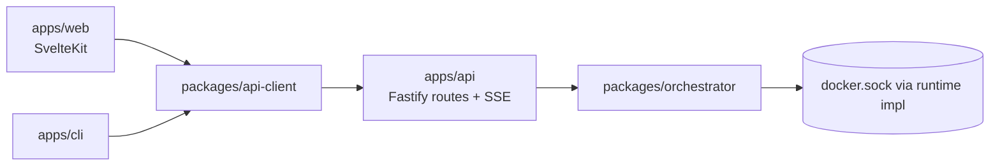

# Devbox architecture

The repository is a monorepo with strict privilege boundaries:

- `packages/orchestrator`: framework-agnostic orchestration logic, job state, Docker runtime abstraction.
- `apps/api`: thin Fastify wrapper exposing orchestration methods + SSE/OpenAPI.
- `packages/api-client`: OpenAPI-derived contract + typed fetch/SSE helpers.
- `apps/web`: SvelteKit-facing UI layer that talks only to the API client.
- `apps/cli`: API-client-only command surface.

Key boundaries:
- Only API/orchestrator layers may access Docker runtime operations.
- Web and CLI are contract consumers via the shared generated API client.
