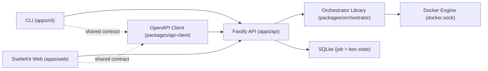

# Architecture

This repo is a small npm-workspaces monorepo with strict privilege boundaries.

## Components
- Orchestrator library: [`packages/orchestrator/src`] encapsulates box/job logic, allowlisted Docker operations, label ownership checks, and in-process job execution.
- Docker runtime adapter: [`packages/orchestrator/src/dockerode-runtime.ts`] talks to Docker Engine API using `dockerode` (no shelling out to Docker CLI).
- API adapter: [`apps/api/src/app.ts`] is a thin Fastify layer that maps HTTP/SSE routes to orchestrator calls, uses TypeBox schemas for validation/typing, and exposes OpenAPI at `/openapi.json`.
- Shared API contract client: [`packages/api-client/src`] is generated from API OpenAPI output, uses `openapi-fetch` for typed REST calls and `parse-sse` for event streams, and is used by both web and CLI.
- Web app: [`apps/web/src/routes/+page.server.ts`] does initial SSR fetch only, then [`apps/web/src/lib/devbox-store.ts`] uses SSE for live updates.
- CLI app: [`apps/cli/src/index.ts`] resolves boxes and runs create/list/stop/remove/logs exclusively through API calls.

## Deployment boundary
- API container is privileged and mounts `docker.sock`.
- Web container is separate and has no Docker socket access.
- Compose wiring is in [`docker-compose.yml`].
- Environment variable defaults and recommendations are documented in [`ENV.md`].
