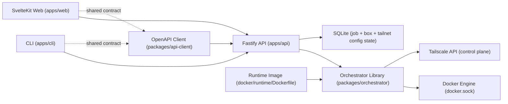

# Architecture

This repo is an npm-workspaces monorepo with strict privilege boundaries between API, web, and CLI.

## Components
- Orchestrator library: [`packages/orchestrator/src`] owns box lifecycle (`create/start/stop/remove`), job orchestration, and Docker allowlisted operations.
- API service: [`apps/api/src/app.ts`] is a thin Fastify wrapper around orchestrator calls and SSE endpoints; OpenAPI is exposed at `/openapi.json`.
- Runtime status monitor: orchestrator subscribes to Docker container events via [`packages/orchestrator/src/dockerode-runtime.ts`] and publishes reconciled `box.updated` and `box.removed` events for live UI state (including external container deletions and managed external starts that recover errored boxes).
- Box log streaming: API exposes box-scoped SSE logs (`/v1/boxes/:boxId/logs`) and forwards `follow/since/tail` to orchestrator runtime log streams with managed-container checks.
- Shared API client: [`packages/api-client/src`] is generated from OpenAPI and used by both web and CLI.
- Web app: [`apps/web/src/routes/+page.server.ts`] handles initial SSR fetch/gating, and [`apps/web/src/lib/devbox-store.ts`] applies SSE updates directly after hydration plus tabbed per-box log viewers rendered with [`apps/web/src/lib/LogTerminal.svelte`] (`xterm`, one mounted terminal for the active tab). UI built with shadcn-svelte (Bits UI) + Tailwind CSS v4, dark theme. Components at [`apps/web/src/lib/components/ui/`].
- CLI app: [`apps/cli/src/index.ts`] is an API client only and does not access Docker or DB directly; log streaming uses API endpoint options (`follow/since/tail`).
- Runtime image: [`docker/runtime/Dockerfile`] defines the image used for created dev boxes.

## Trust boundaries
- API is the only privileged component and is the only service that can mount `docker.sock`.
- Orchestrator operations must be allowlisted and constrained to managed resources.
- Web and CLI are unprivileged API consumers and never access Docker or DB directly.
- API and web are deployed as separate containers/services.

## Tailscale integration
- Tailnet config (OAuth credentials, tags, hostname prefix) stored in single-row `tailnet_config` SQLite table.
- Config is locked (409) while boxes exist to prevent credential drift.
- Box creation: orchestrator mints a per-box Tailscale auth key (ephemeral: false, reusable: false, preauthorized: true), injects it as container env, and adds `/dev/net/tun` device + `NET_ADMIN`/`NET_RAW` capabilities.
- Device capture: after container start, orchestrator polls Tailscale control plane by deterministic hostname with retry and persists `tailnetDeviceId`.
- Box start: reuses persisted `tailnetDeviceId` (no in-container exec lookup).
- Box removal: Tailnet device deleted by persisted device ID. Cleanup errors are warnings, not fatal.
- External container deletion: reconciliation enqueues a cleanup job (Tailnet device + network + volume + DB row) instead of hard-deleting immediately.
- Runtime entrypoint (`docker/runtime/dev-entrypoint.sh`): uses fixed state dir (`/workspace/.tailscale`), authenticates with authkey on first boot, reconnects from persisted state on restart, and applies iptables firewall (allow lo + established + tailscale0, drop rest).

## Runtime network model
- Each created box is assigned a dedicated Docker network (`devbox-net-<boxId>`) by the orchestrator and attached to that network as its container `NetworkMode`.
- Boxes are therefore isolated from each other by default at the Docker-network level (no shared box network).
- Inbound traffic to each box is restricted to Tailnet only via iptables rules in the container entrypoint.
- Caveat: these per-box networks use Docker bridge defaults (not `internal` and no egress policy), so outbound connectivity is still available from each box subject to host/Docker routing and firewall policy.

## Key references
- Compose deployment wiring: [`docker-compose.yml`]
- Environment contract: [`ENV.md`]
- Setup and user workflows: [`USAGE.md`]
